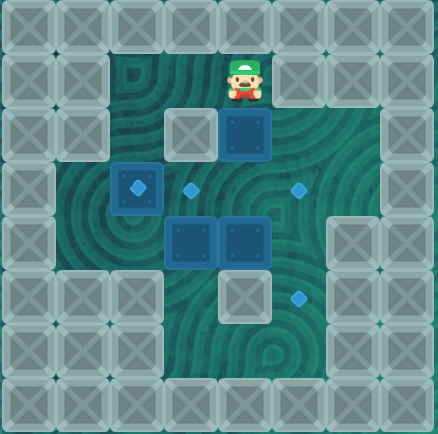
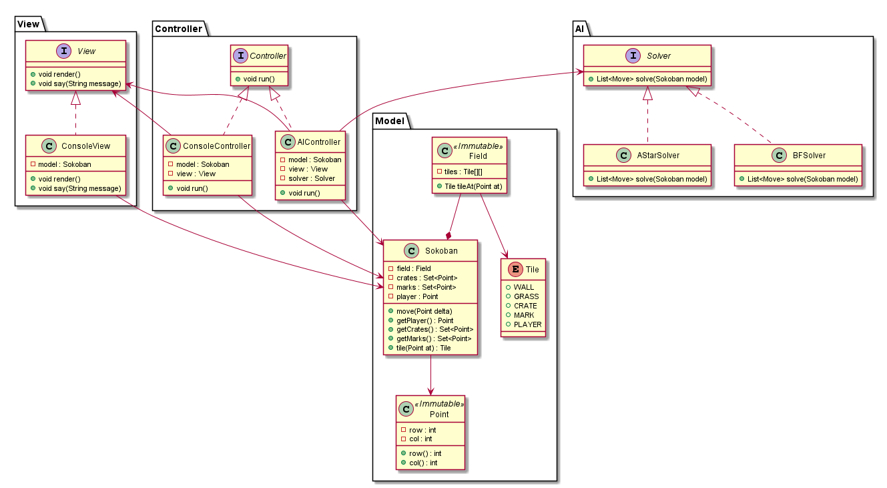
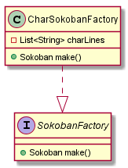

# AI на минималках: Пишем свой Сокобан и учим компьютер его решать
В этой статье я расскажу как написать свою реализацию известной игрушки Сокобан, а также алгоритм для её решения с нуля. Заодно применим на практике некоторые шаблоны
проектирования и принципы SOLID.


## Предыстория
Я пользуюсь кнопочным телефоном. Из развлечений на нём только радио и единственная игра Сокобан из 15 уровней. Из них я решил только 10 и застрял на одиннадцатом.
Как-то раз я целый день ехал в поезде и решал этот злосчастный 11 уровень, но не преуспел. Тогда я решил прибегнуть к помощи компьютера, благо опыт программирования
имею достаточный для такой задачи. Поставил цель: самостоятельно написать реализацию с решением этой игрушки. По результатам появилась эта статья.

Тот самый 11 уровень:


Сама игрушка представляет собой прямоугольное 2D поле, на котором раскиданы ящики, стены и метки. Ящики можно толкать, но не тянуть, в этом вся сложность.
Ваша цель: переместить все ящики на клетки с метками. Пример игры:


## Пишем реализацию
Давайте не будем усложнять себе задачу и создавать отдельный GUI со спрайтами и редактором уровней. Вместо этого остановимся на консольном варианте а-ля Rogue-like,
где уровни будут отрисовываться построчно и загружаться из текстового файла. Сначала нужно придумать какие символы будут обозначать элементы на уровне. Я сделал
такой выбор:
* Решётка # это стена, через неё нельзя пройти и продвинуть ящик.
* Буква O это ящик.
* Буква X это метка, куда нужно переместить ящик.
* Собака @ означает игрока.
* Точка означает пустое место.
* Буква G это ящик на метке.

Теперь самый ответственный момент -- выбор архитектуры приложения. Если ошибиться, то можно сильно повредить всей дальнейшей разработке. В нашем случае идеально
подходит шаблон MVC -- Модель, Представление, Контроллер. Модель хранит внутреннее игровое состояние и поле, даёт доступ к данным, не знает ничего о контроллере и
представлении. Представление только печатает состояние модели в консоль. Контроллер считывает символы с клавиатуры и изменяет модель. Типичная ошибка новичков --
добавлять бизнес-логику в контроллер вместо модели. В результате получаются переполненные чужим кодом контроллеры, нарушающие первую букву SOLID. Согласно ей, каждый
класс должен брать на себя только одну ответственность. Представление -- печатать уровни в консоль, модель -- хранить состояние игрушки и логику работы с ним,
контроллер -- обрабатывать действия пользователя. То есть контроллер не должен знать как именно двигать ящики и игрока по полю, это ответственность модели. Контроллеру
всего лишь нужно вызвать соответствующий метод. Ещё хорошо бы скрыть реализации всех трёх сущностей за интерфейсами. Это даёт следующее:

* Можно спокойно менять реализации, например, написать GUI представление. На существующий код это никак не повлияет.
* В совокупности с инъекцией зависимостей значительно упрощается модульное тестирование.

Вторая частая ошибка новичков в ООП -- компоненты сами управляют своими зависимостями, например создают экземпляры конкретных реализаций интерфейсов в конструкторах:
```java
public class ConsoleController implements Controller
{
    private final Model model;
    private final View view;

    public ConsoleController(final Model model)
    {
        this.model = model;
        this.view = new ConsoleView(model);
    }
    // methods
}
```

Здесь первая зависимость model была установлена как надо, через ссылку в параметре конструктора, а вторая view создана напрямую. Это плохо хотя бы потому, что теперь
ConsoleController должен знать не только о View, но и ConsoleView, что повышает зацепление. Изменения ConsoleView могут повлечь за собой изменения в
ConsoleController, чего можно избежать, написав вот так:

```java
public class ConsoleController implements Controller
{
    private final Model model;
    private final View view;

    public ConsoleController(final Model model, final View view)
    {
        this.model = model;
        this.view = view;
    }
    // methods
}
```

Теперь класс ConsoleController стало проще тестировать. Суть буквы D в SOLI*D* в том, что класс не должен контролировать то, как именно удовлетворяются его
зависимости. Эта ответственность теперь ложится на клиентов класса. Есть множество механизмов разрешения зависимостей, самый популярный из которых -- контейнер
зависимостей. Это отдельный модуль, обычно реализованный каким-нибудь фреймфорком типа Spring или библиотекой, который сам может прокинуть все необходимые экземпляры
в конструкторы или сеттеры. От вас нужно только их объявить.

Нужно придумать что из себя вообще представляет модель игрушки. Посмотрим ещё раз на скриншот, что мы видим?
* Квадратное поле из различных плиток
* Набор ящиков и меток
* Игрока
Каждую клетку на поле можно моделировать двумерным вектором `(row, col)`, где `row` это номер строки, а `col` столбца клетки, начиная с нуля. 
Каждой клетке будет соответствовать плитка -- пустое место, куда можно сходить или стена.
Ящики не пронумерованы, любой ящик можно поставить на любую метку, поэтому можно смоделировать их как множества клеток, на которых расположены
ящики и метки. Позиция игрока также моделируется клеткой.

Было бы логичным научить модель саму себя решать, то есть поместить алгоритм поиска решения внутри модели. Однако, если мы захотим иметь 
несколько таких алгоритмов и сравнивать их между собой, то лучше будет вынести их в отдельный модуль, скрытый за интерфейсом. В этом суть 
шаблона "Стратегия" -- выносить несколько реализаций одной функции в отдельные классы и прятать их под общим интерфейсом, потому что клиенту
в большинстве случаев всё равно как именно вычисляется ваша функция, он хочет просто получить результат.
У меня получилось вот такая архитектура:



Заметьте, здесь модель представлена не одним классом, а целым пакетом Model. Главный класс Sokoban не скрыт за интерфейсом, потому что представляет единственную реализацию модели игрушки.
Метод `move()` двигает игрока в одну из четырёх сторон. Сам Sokoban можно изменить только вызвав этот метод. Методы `getCrates()` и `getMarks()` возвращают неизменяемое представление множеств.
Забегая вперёд, скажу что я сразу заложил два алгоритма решения Сокобана: обход графа конфигураций в ширину и поиск оптимального пути от начальной конфигурации до выигрышной с помощью A* (A star algorithm). 

Метод `run()` запускает цикл "отрисовка уровня -> считывание движения -> обновление модели -> отрисовка" 

Уровни будут загружаться из текстового файла со строками символов клеток, например:

```
###########
#.@..O..X.#
###########
```

Чтение и парсинг файла лучше тоже вынести в отдельный класс-создатель модели. Здесь идеально подходит шаблон "Абстрактная фабрика".
Вкратце: внутри класса `CharSokobanFactory` пишем код чтения и парсинга файла, создаём игрока, поле, множество меток и ящиков.
Важно, чтобы конструктор класса `Sokoban` оставался чистым, то есть содержал только присвоения зависимостей, это упрощает тестирование:

```
    public Sokoban(final Field field, final Set<Point> crates, final Set<Point> marks, final Point player)
    {
        this.field = field;
        this.crates = crates;
        this.marks = marks;
        this.player = player;
    }
```

Созданием этих зависимостей как раз и займётся `CharSokobanFactory`. Фабрику нужно скрыть за интерфейсом, чтобы не привязываться к созданию модели через символьные строки.
В будущем можно использовать другой формат хранения уровней.



